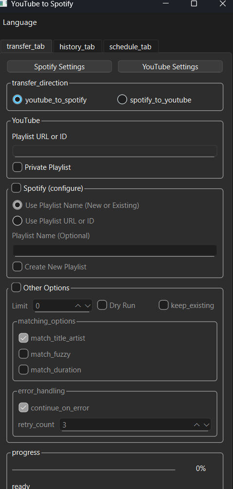
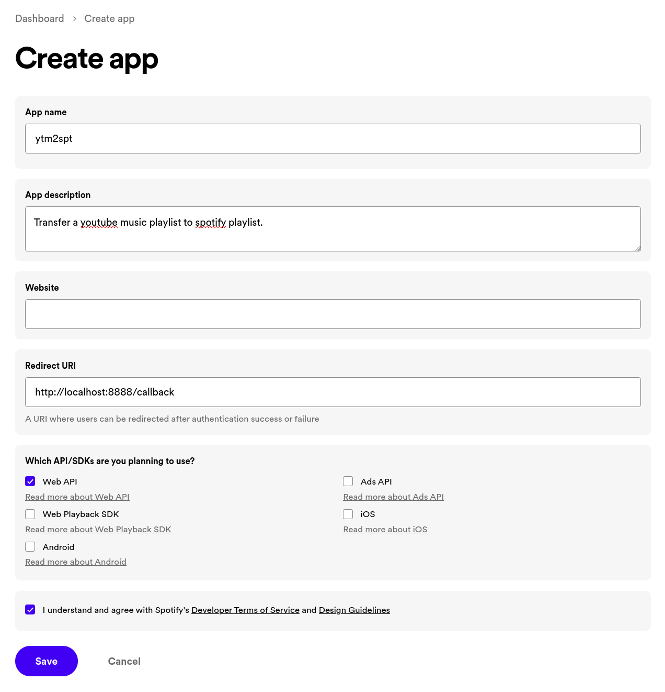
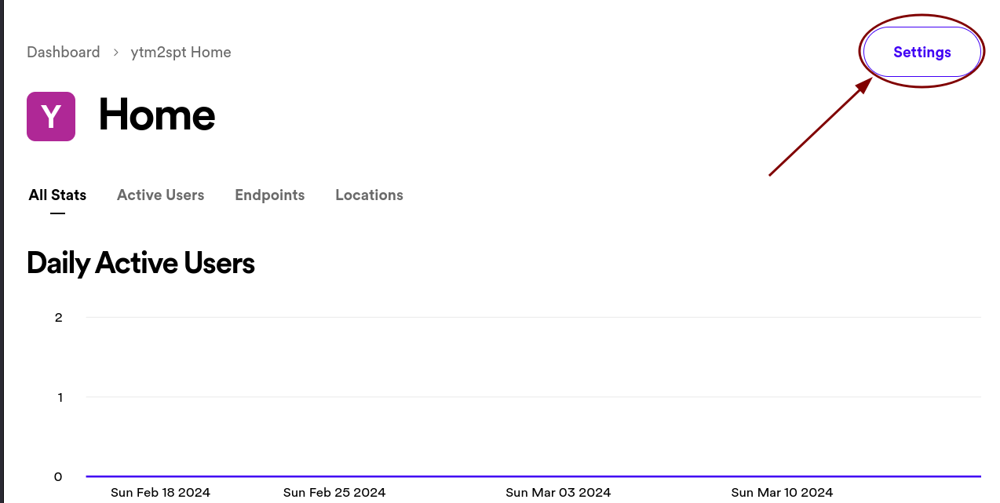
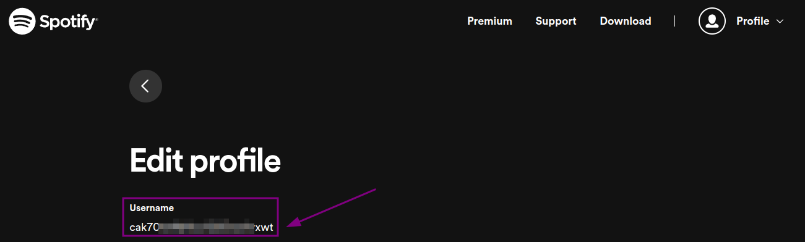
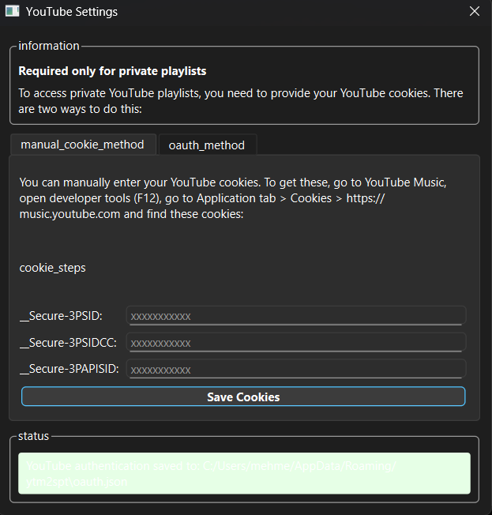

# TrackShift - YouTube to Spotify Transfer Tool

[](https://www.gnu.org/licenses/gpl-3.0)


TrackShift is a tool that lets you easily transfer your YouTube playlists to Spotify. It supports both YouTube Music playlists and regular YouTube playlists.

*[Türkçe README için aşağı kaydırın](#trackshift---youtube---spotify-aktarım-aracı)*



## Features

- 🎵 Transfer YouTube and YouTube Music playlists to Spotify
- 🔒 Access to private YouTube playlists
- 📊 Simple and user-friendly interface
- 🏷️ Progress and status notifications
- 🖼️ Automatic transfer of YouTube playlist cover to Spotify
- 💫 Automatic creation of playlist description in Spotify
- 📝 Logging for comprehensive debugging

## Usage

To use TrackShift:

1. You need Python 3.8 or newer on your computer.
2. Download or clone the project from GitHub.
3. Install required packages: `pip install -r requirements.txt`
4. Set up your Spotify and YouTube accounts (instructions below).
5. Run the application: `python ytm2spt.py`

## Setup

### Spotify Account Settings

1. Log in to [Spotify Developer Dashboard](https://developer.spotify.com/dashboard)
2. Create a new application (Click on "Create An App" in the top right corner)
   
3. Enter application name and description, accept terms of use
4. Go to the settings page of the created application
5. Click "Edit Settings" and add the following "Redirect URI": `http://127.0.0.1:8888/callback`
   
6. Note the Client ID and Client Secret
   
7. You can find your Spotify username from [your Spotify account page](https://www.spotify.com/account/overview/)
   

### YouTube Account Settings (For Private Playlists)

If you want to access private playlists (likes, etc.), you need to authenticate with your YouTube account. There are two methods that you can access from "Settings > YouTube Account Settings" menu in the application:

#### 1. Manual Cookie Method

This method allows you to authenticate by copying YouTube cookies from your browser:

1. Log in to YouTube in Chrome, Edge, or Firefox
2. Press F12 to open developer tools
3. Click on the "Application" tab
4. Find the "Cookies" section on the left
5. Select the "https://www.youtube.com" site
6. Find and copy the following cookie values:
   - `__Secure-3PSID`
   - `__Secure-3PAPISID`
   - `__Secure-3PSIDCC`
7. Paste these values into the corresponding fields in the application and click "Save"



#### 2. OAuth Method (Recommended)

This method provides a more secure authentication process:

1. Click "Authenticate with YouTube OAuth" button in the application
2. Log in with your Google account in the browser window that opens
3. Approve the requested permissions
4. The authentication process will be completed automatically

Both methods securely store the credentials needed to access your private playlists locally.

### Environment Variables

Set the following environment variables before running TrackShift:

```
SPOTIFY_CLIENT_ID=your_client_id
SPOTIFY_CLIENT_SECRET=your_client_secret
SPOTIFY_USER_ID=your_spotify_username
SPOTIFY_REDIRECT_URI=http://127.0.0.1:8888/callback
```

Windows users can fill in and run the `env.bat` file.

## Supported Playlist Types

- YouTube Music playlists (`https://music.youtube.com/playlist?list=...`)
- Regular YouTube playlists (`https://youtube.com/playlist?list=...`)
- YouTube Liked videos list (when "Private playlists" option is checked)
- Playlists in your account using local YouTube Music API

## Debugging

If you encounter issues while running the application, check the generated log files:

- YouTube API: `youtube.log`
- Spotify API: `spotify.log`
- General application: `trackshift.log`

## Contributing

1. Fork this repo
2. Create your feature branch (`git checkout -b feature/amazing-feature`)
3. Commit your changes (`git commit -m 'Add some amazing feature'`)
4. Push to the branch (`git push origin feature/amazing-feature`)
5. Open a Pull Request

## Original Project and Acknowledgements

This project is derived from [abhishekmj303/ytm2spt](https://github.com/abhishekmj303/ytm2spt) and includes various improvements and bug fixes. Thanks to abhishekmj303 for the original work.

## License

This project is licensed under the GNU General Public License v3.0 (GPL-3.0). See the `LICENSE.md` file for more information.

## Contact

Mehmet Efe AYTAŞ - [GitHub](https://github.com/mehmetefeaytas)

Project Link: [https://github.com/mehmetefeaytas/trackshift](https://github.com/mehmetefeaytas/trackshift)

---

# TrackShift - YouTube -> Spotify Aktarım Aracı

[](https://www.gnu.org/licenses/gpl-3.0)


TrackShift, YouTube çalma listelerinizi Spotify'a kolayca aktarmanızı sağlayan bir araçtır. Hem YouTube Music çalma listelerini hem de normal YouTube çalma listelerini destekler.

*[Click for English README](#trackshift---youtube-to-spotify-transfer-tool)*


## Özellikler

- 🎵 YouTube ve YouTube Music çalma listelerini Spotify'a aktarın
- 🔒 Özel YouTube çalma listelerine erişim desteği
- 📊 Basit ve kullanıcı dostu arayüz
- 🏷️ İlerleme ve durum bilgilendirmeleri
- 🖼️ YouTube çalma listesi kapağı Spotify'a otomatik aktarım
- 💫 Spotify'da çalma listesi açıklaması otomatik oluşturma
- 📝 Kapsamlı hata ayıklama için günlük kaydı

## Kullanım

TrackShift'i kullanmak için:

1. Bilgisayarınızda Python 3.8 veya daha yeni bir sürüm olmalıdır.
2. GitHub'dan projeyi indirin veya klonlayın.
3. Gerekli paketleri yükleyin: `pip install -r requirements.txt`
4. Spotify ve YouTube hesaplarınızı ayarlayın (aşağıdaki talimatlar).
5. Uygulamayı çalıştırın: `python ytm2spt.py`

## Kurulum

### Spotify Hesap Ayarları

1. [Spotify Developer Dashboard](https://developer.spotify.com/dashboard)'a giriş yapın
2. Yeni bir uygulama oluşturun (Sağ üst köşedeki "Create An App" butonuna tıklayın)
   
3. Uygulama adını ve açıklamasını girin, kullanım şartlarını kabul edin
4. Oluşturulan uygulamanın ayarlar sayfasına gidin 
5. "Edit Settings" tıklayın ve şu "Redirect URI" adresini ekleyin: `http://127.0.0.1:8888/callback`
   
6. İstemci Kimliği (Client ID) ve İstemci Sırrını (Client Secret) not edin
   
7. Spotify kullanıcı adınızı [Spotify hesap sayfanızdan](https://www.spotify.com/account/overview/) bulabilirsiniz
   

### YouTube Hesap Ayarları (Özel çalma listeleri için)

Özel çalma listelerine (beğendiklerim vb.) erişmek istiyorsanız, YouTube hesabınızla kimlik doğrulaması yapmanız gerekir. Uygulamada "Ayarlar > YouTube Hesap Ayarları" menüsünden erişebileceğiniz iki yöntem bulunmaktadır:

#### 1. Manuel Çerez (Cookie) Yöntemi

Bu yöntem, tarayıcınızdan YouTube çerezlerini kopyalayarak kimlik doğrulaması yapmanızı sağlar:

1. Chrome, Edge veya Firefox'ta YouTube'a giriş yapın
2. F12 tuşuna basarak geliştirici araçlarını açın
3. "Uygulama" veya "Application" sekmesine tıklayın
4. Sol tarafta "Çerezler" veya "Cookies" bölümünü bulun
5. "https://www.youtube.com" sitesini seçin
6. Aşağıdaki çerez değerlerini bulun ve kopyalayın:
   - `__Secure-3PSID`
   - `__Secure-3PAPISID`
   - `__Secure-3PSIDCC`
7. Bu değerleri uygulamadaki ilgili alanlara yapıştırın ve "Kaydet" düğmesine tıklayın


#### 2. OAuth Yöntemi (Tavsiye Edilen)

Bu yöntem, daha güvenli bir kimlik doğrulama süreci sağlar:

1. Uygulamada "YouTube OAuth ile Kimlik Doğrula" düğmesine tıklayın
2. Açılan tarayıcı penceresinde Google hesabınızla giriş yapın
3. İstenen izinleri onaylayın
4. Kimlik doğrulama işlemi otomatik olarak tamamlanacaktır

Her iki yöntem de özel çalma listelerinize erişim için gerekli olan kimlik bilgilerini güvenli bir şekilde yerel olarak saklar.

### Çevresel Değişkenler

TrackShift çalıştırılmadan önce aşağıdaki çevresel değişkenleri ayarlayın:

```
SPOTIFY_CLIENT_ID=your_client_id
SPOTIFY_CLIENT_SECRET=your_client_secret
SPOTIFY_USER_ID=your_spotify_username
SPOTIFY_REDIRECT_URI=http://127.0.0.1:8888/callback
```

Windows kullanıcıları için `env.bat` dosyasını doldurup çalıştırabilirsiniz.

## Desteklenen Çalma Listesi Türleri

- YouTube Music çalma listeleri (`https://music.youtube.com/playlist?list=...`)
- Normal YouTube çalma listeleri (`https://youtube.com/playlist?list=...`)
- YouTube Beğendiklerim listesi (Özel çalma listeleri seçeneği işaretlendiğinde)
- Yerel YouTube Music API kullanarak hesabınızdaki çalma listeleri

## Hata Ayıklama

Uygulama çalışırken sorunlarla karşılaşırsanız, oluşturulan günlük dosyalarını kontrol edin:

- YouTube API: `youtube.log`
- Spotify API: `spotify.log`
- Genel uygulama: `trackshift.log`

## Katkıda Bulunma

1. Bu repoyu forklayın
2. Kendi branch'inizi oluşturun (`git checkout -b feature/amazing-feature`)
3. Değişikliklerinizi commit edin (`git commit -m 'Add some amazing feature'`)
4. Branch'inize push edin (`git push origin feature/amazing-feature`)
5. Pull Request açın

## Orijinal Proje ve Teşekkürler

Bu proje, [abhishekmj303/ytm2spt](https://github.com/abhishekmj303/ytm2spt) projesinden türetilmiştir ve üzerinde çeşitli iyileştirmeler ve hata düzeltmeleri yapılmıştır. Orijinal çalışma için abhishekmj303'e teşekkürler.

## Lisans

Bu proje GNU Genel Kamu Lisansı v3.0 (GPL-3.0) altında lisanslanmıştır. Daha fazla bilgi için `LICENSE.md` dosyasına bakın.

## İletişim

Mehmet Efe AYTAŞ - [GitHub](https://github.com/mehmetefeaytas)

Proje Bağlantısı: [https://github.com/mehmetefeaytas/trackshift](https://github.com/mehmetefeaytas/trackshift)
