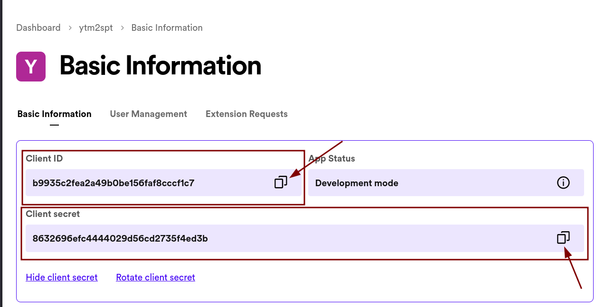
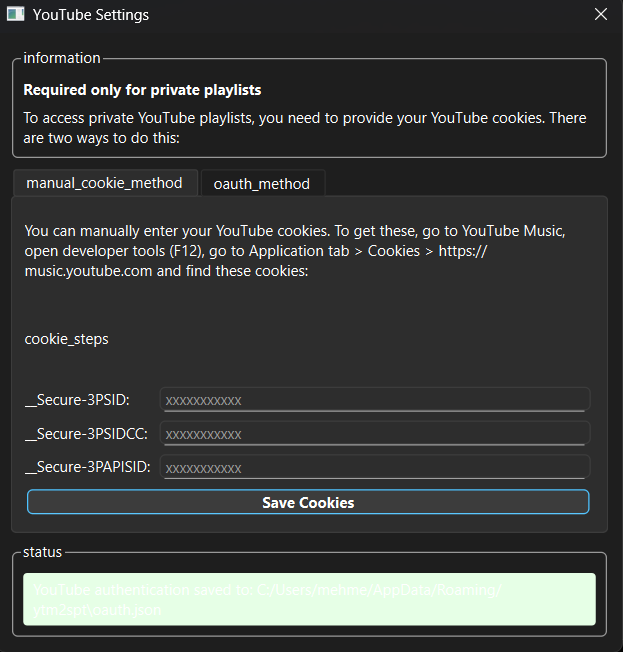

# TrackShift - YouTube -> Spotify Aktarım Aracı

[](https://www.gnu.org/licenses/gpl-3.0)


TrackShift, YouTube çalma listelerinizi Spotify'a kolayca aktarmanızı sağlayan bir araçtır. Hem YouTube Music çalma listelerini hem de normal YouTube çalma listelerini destekler.


## Özellikler

- 🎵 YouTube ve YouTube Music çalma listelerini Spotify'a aktarın
- 🔒 Özel YouTube çalma listelerine erişim desteği
- 📊 Basit ve kullanıcı dostu arayüz
- 🏷️ İlerleme ve durum bilgilendirmeleri
- 🖼️ YouTube çalma listesi kapağı Spotify'a otomatik aktarım
- 💫 Spotify'da çalma listesi açıklaması otomatik oluşturma
- 📝 Kapsamlı hata ayıklama için günlük kaydı

## Kullanım

TrackShift'i kullanmak için:

1. Bilgisayarınızda Python 3.8 veya daha yeni bir sürüm olmalıdır.
2. GitHub'dan projeyi indirin veya klonlayın.
3. Gerekli paketleri yükleyin: `pip install -r requirements.txt`
4. Spotify ve YouTube hesaplarınızı ayarlayın (aşağıdaki talimatlar).
5. Uygulamayı çalıştırın: `python ytm2spt.py`

## Kurulum

### Spotify Hesap Ayarları

1. [Spotify Developer Dashboard](https://developer.spotify.com/dashboard)'a giriş yapın
2. Yeni bir uygulama oluşturun (Sağ üst köşedeki "Create An App" butonuna tıklayın)
   
3. Uygulama adını ve açıklamasını girin, kullanım şartlarını kabul edin
4. Oluşturulan uygulamanın ayarlar sayfasına gidin 
5. "Edit Settings" tıklayın ve şu "Redirect URI" adresini ekleyin: `http://127.0.0.1:8888/callback`
   
6. İstemci Kimliği (Client ID) ve İstemci Sırrını (Client Secret) not edin
   
7. Spotify kullanıcı adınızı [Spotify hesap sayfanızdan](https://www.spotify.com/account/overview/) bulabilirsiniz
   

### YouTube Hesap Ayarları (Özel çalma listeleri için)

Özel çalma listelerine (beğendiklerim vb.) erişmek istiyorsanız, YouTube hesabınızla kimlik doğrulaması yapmanız gerekir. Uygulamada "Ayarlar > YouTube Hesap Ayarları" menüsünden erişebileceğiniz iki yöntem bulunmaktadır:

#### 1. Manuel Çerez (Cookie) Yöntemi

Bu yöntem, tarayıcınızdan YouTube çerezlerini kopyalayarak kimlik doğrulaması yapmanızı sağlar:

1. Chrome, Edge veya Firefox'ta YouTube'a giriş yapın
2. F12 tuşuna basarak geliştirici araçlarını açın
3. "Uygulama" veya "Application" sekmesine tıklayın
4. Sol tarafta "Çerezler" veya "Cookies" bölümünü bulun
5. "https://www.youtube.com" sitesini seçin
6. Aşağıdaki çerez değerlerini bulun ve kopyalayın:
   - `__Secure-3PSID`
   - `__Secure-3PAPISID`
   - `__Secure-3PSIDCC`
7. Bu değerleri uygulamadaki ilgili alanlara yapıştırın ve "Kaydet" düğmesine tıklayın



#### 2. OAuth Yöntemi (Tavsiye Edilen)

Bu yöntem, daha güvenli bir kimlik doğrulama süreci sağlar:

1. Uygulamada "YouTube OAuth ile Kimlik Doğrula" düğmesine tıklayın
2. Açılan tarayıcı penceresinde Google hesabınızla giriş yapın
3. İstenen izinleri onaylayın
4. Kimlik doğrulama işlemi otomatik olarak tamamlanacaktır

Her iki yöntem de özel çalma listelerinize erişim için gerekli olan kimlik bilgilerini güvenli bir şekilde yerel olarak saklar.

### Çevresel Değişkenler

TrackShift çalıştırılmadan önce aşağıdaki çevresel değişkenleri ayarlayın:

```
SPOTIFY_CLIENT_ID=your_client_id
SPOTIFY_CLIENT_SECRET=your_client_secret
SPOTIFY_USER_ID=your_spotify_username
SPOTIFY_REDIRECT_URI=http://127.0.0.1:8888/callback
```

Windows kullanıcıları için `env.bat` dosyasını doldurup çalıştırabilirsiniz.

## Desteklenen Çalma Listesi Türleri

- YouTube Music çalma listeleri (`https://music.youtube.com/playlist?list=...`)
- Normal YouTube çalma listeleri (`https://youtube.com/playlist?list=...`)
- YouTube Beğendiklerim listesi (Özel çalma listeleri seçeneği işaretlendiğinde)
- Yerel YouTube Music API kullanarak hesabınızdaki çalma listeleri

## Hata Ayıklama

Uygulama çalışırken sorunlarla karşılaşırsanız, oluşturulan günlük dosyalarını kontrol edin:

- YouTube API: `youtube.log`
- Spotify API: `spotify.log`
- Genel uygulama: `trackshift.log`

## Katkıda Bulunma

1. Bu repoyu forklayın
2. Kendi branch'inizi oluşturun (`git checkout -b feature/amazing-feature`)
3. Değişikliklerinizi commit edin (`git commit -m 'Add some amazing feature'`)
4. Branch'inize push edin (`git push origin feature/amazing-feature`)
5. Pull Request açın

## Orijinal Proje ve Teşekkürler

Bu proje, [abhishekmj303/ytm2spt](https://github.com/abhishekmj303/ytm2spt) projesinden türetilmiştir ve üzerinde çeşitli iyileştirmeler ve hata düzeltmeleri yapılmıştır. Orijinal çalışma için abhishekmj303'e teşekkürler.

## Lisans

Bu proje GNU Genel Kamu Lisansı v3.0 (GPL-3.0) altında lisanslanmıştır. Daha fazla bilgi için `LICENSE.md` dosyasına bakın.

## İletişim

Mehmet Efe AYTAŞ - [GitHub](https://github.com/mehmetefeaytas)

Proje Bağlantısı: [https://github.com/mehmetefeaytas/trackshift](https://github.com/mehmetefeaytas/trackshift)
